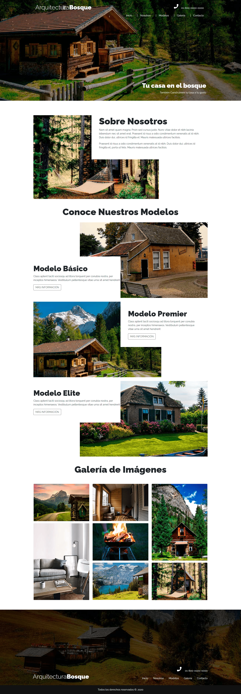

# Proyecto web para Arquitectos
Se realizo una web para arquitectos, tan importante es realizar buenos proyectos arquitectónicos como tener una buena forma de mostrarlos. Para dicho proyecto se utilizo Bootstrap  🏆   

