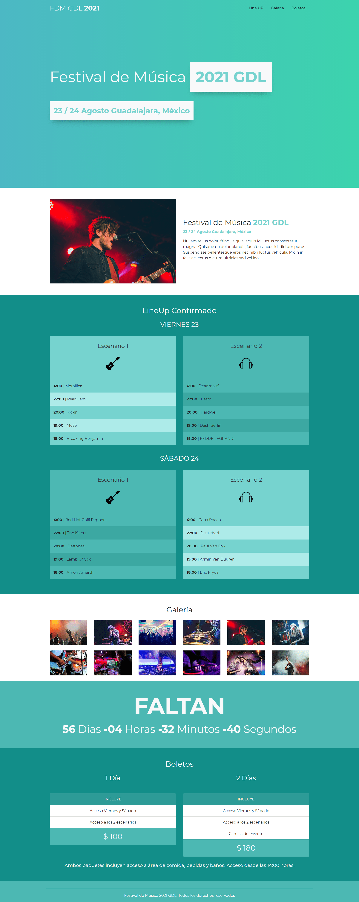

# Proyecto web para festival de Música
Se realizó una web para agendar festivales de música, que proporciona listados de eventos musicales dentro de México en Guadalajara. Para dicho proyecto se utilizó Bootstrap. 🏆   

