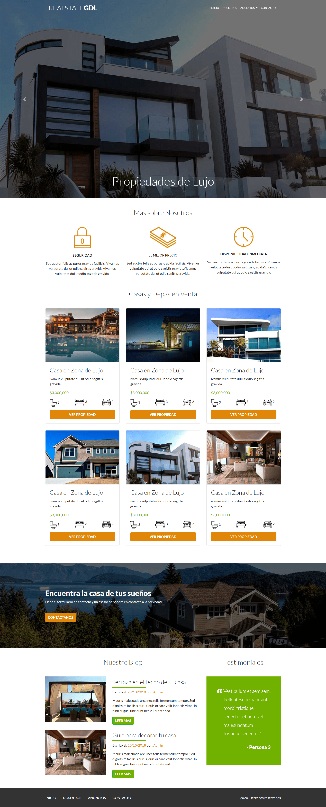

# Proyecto web de bienes raíces.
Se diseñó una web de bienes raíces para mostrar las propiedades popularles y animar a los visitantes a checarla y preguntar sobre rentar o comprar. Para dicho proyecto se utilizó Bootstrap. 🏆   

