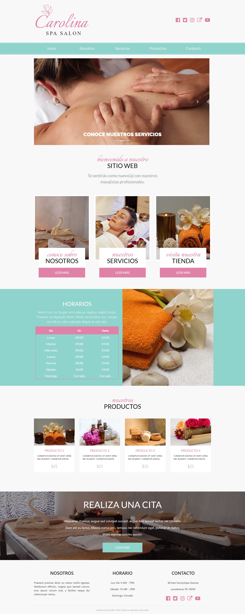

# Proyecto web carolina SPA.
Se diseñó una platilla web para un SPA con el objetivo de tener presencia online para vender más tratamientos y productos. Para dicho proyecto se utilizó Bootstrap. 🏆   

