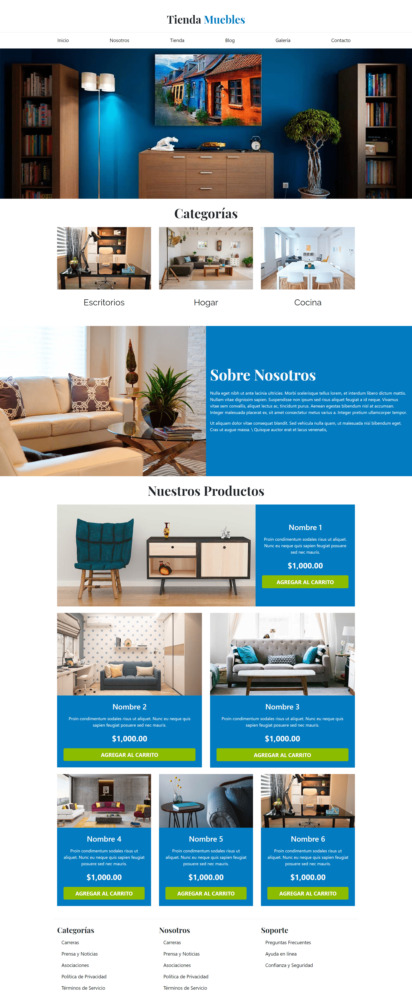

# Proyecto web tienda de muebles.
Se diseñó una web para venta de muebles, fábricas de muebles, tiendas de decoración y catálogos digitales de mobiliario. Para dicho proyecto se utilizó Bootstrap. 🏆   

