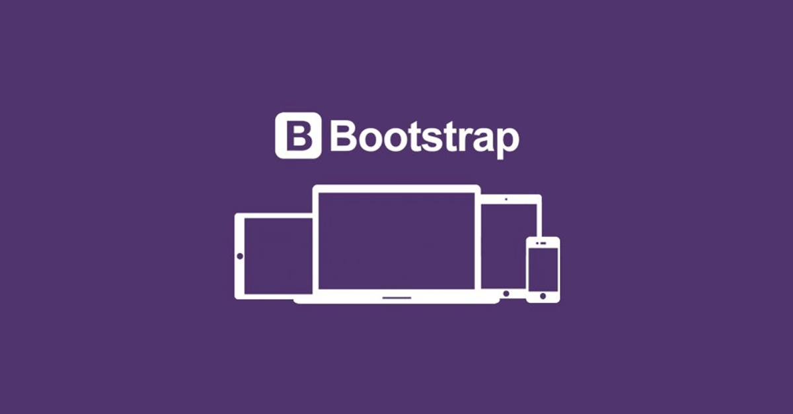

# Practicas de Bootstrap.
Bootstrap es un **Framework Front-end** utilizado para desarrollar aplicaciones web y sitios mobile first. El framework combina _CSS y JavaScript_ para estilizar los elementos de una página HTML. Esta es una herramienta que proporciona ***interactividad*** en la página, por lo que ofrece una serie de componentes que facilitan la ***comunicación con el usuario***, _como menús de navegación, controles de página, barras de progreso y más_.  

